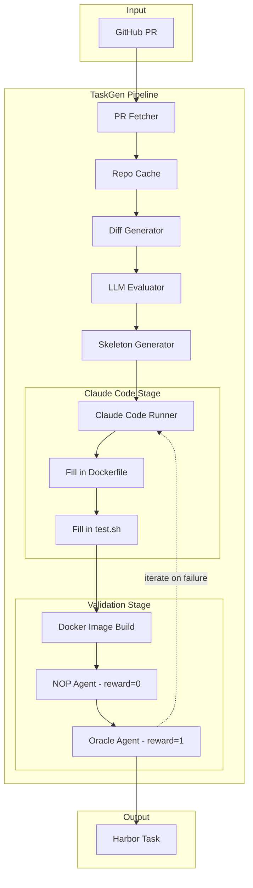
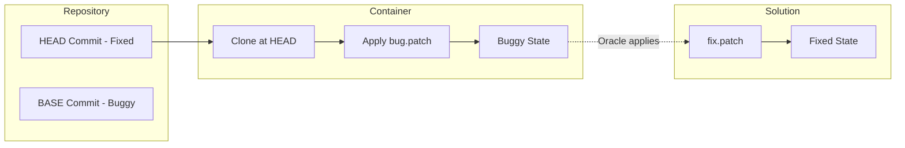
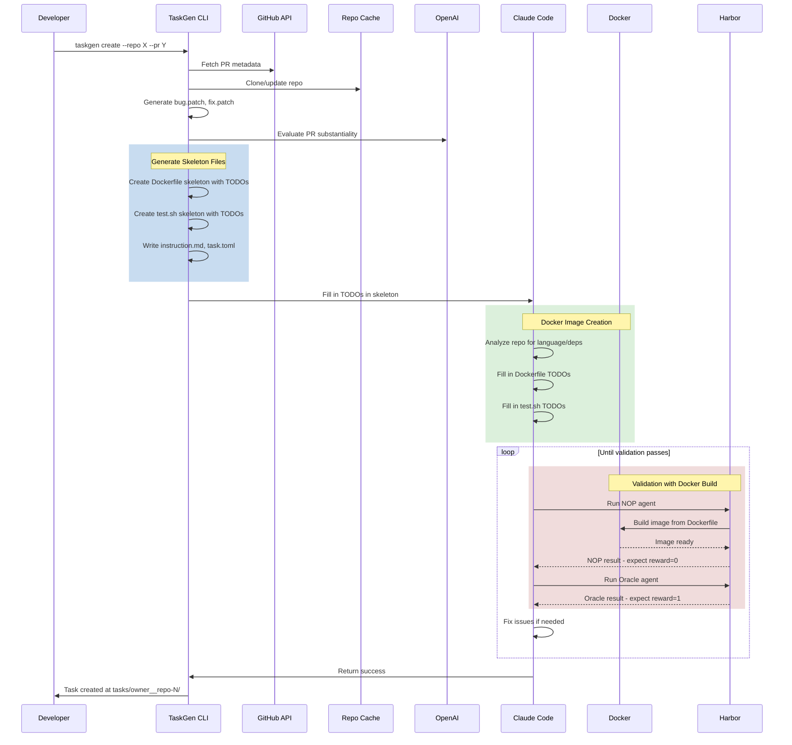

# TaskGen Architecture

TaskGen is a pipeline for converting merged GitHub pull requests into [Harbor](https://github.com/laude-institute/harbor) evaluation tasks. It automates the creation of fully containerized, reproducible software engineering tasks from real-world bug fixes.

## Architecture Overview

The following diagram shows the high-level architecture of TaskGen, highlighting the Docker image creation process as a central part of the pipeline:



## Pipeline Stages

### 1. PR Fetching

The pipeline begins by fetching PR metadata from GitHub:

- **Module**: `src/taskgen/create/pr_fetcher.py`
- **Inputs**: Repository name (`owner/repo`), PR number, GitHub token
- **Outputs**: PR metadata (title, body, base/head SHAs), linked issues, file changes

The fetcher validates that the PR is merged and retrieves all associated data needed for task generation.

### 2. Repository Caching

To avoid repeated cloning, TaskGen maintains a local cache of repositories:

- **Module**: `src/taskgen/create/repo_cache.py`
- **Location**: `.state/repos/`
- **Behavior**: Clones and checks out the **PR head commit SHA** (the tip of the PR's source branch, from the GitHub PR API field `pulls[].head.sha`). This is **not** the "HEAD of the remote repository's default branch". Cached repos are updated via `git fetch` and then checked out at that PR head SHA.

### 3. Diff Generation

Generates the patches that define the task:

- **Module**: `src/taskgen/create/diff_utils.py`
- **Outputs**:
  - `bug.patch` - Reverts PR changes to create buggy state
  - `fix.patch` - The actual fix (stored in solution/)
- **Test File Handling**: Test files are excluded from patches and extracted separately

### 4. LLM Evaluation

Uses OpenAI to evaluate PR substantiality and generate task instructions:

- **Module**: `src/taskgen/create/task_instruction.py`
- **Checks**:
  - Minimum source file changes (default: 3-10 files)
  - Not purely documentation/CI/formatting changes
  - Linked issue presence (optional)
- **Generates**: Task instruction from issue/PR description, difficulty rating, category tags

### 5. Skeleton Generation

Creates template files with deterministic parts filled in and TODOs for Claude Code:

- **Module**: `src/taskgen/create/task_skeleton.py`
- **Generated Files**:
  - `environment/Dockerfile` - Universal skeleton with language TODOs
  - `environment/bug.patch` - Reverts to buggy state
  - `tests/test.sh` - Test runner skeleton with TODOs
  - `instruction.md` - Bug description for agents
  - `task.toml` - Task metadata
  - `solution/fix.patch` - The actual fix
  - `solution/solve.sh` - Applies fix.patch

### 6. Claude Code Session

Claude Code analyzes the repository and completes the skeleton:

- **Module**: `src/taskgen/create/claude_code_runner.py`
- **Tasks**:
  - Detect language, runtime, build system, test framework
  - Fill in Dockerfile TODOs (runtime, packages, deps, build steps)
  - Fill in test.sh TODOs (correct test command for specific files)
  - Run Harbor validation and iterate until passing

### 7. Validation

Validates the task using Harbor's NOP and Oracle agents:

- **Module**: `src/taskgen/tools/validate.py`
- **NOP Agent**: Does nothing, expects tests to fail (reward=0)
- **Oracle Agent**: Applies fix.patch, expects tests to pass (reward=1)

---

## Docker Image Creation

TaskGen uses a **universal skeleton approach** for Docker image creation, which is language-agnostic and relies on Claude Code to fill in language-specific details.

### Skeleton Dockerfile Structure

```dockerfile
FROM ubuntu:24.04

# Base system packages (always included)
RUN apt-get update && apt-get install -y \
    git curl ca-certificates patch build-essential \
    && rm -rf /var/lib/apt/lists/*

# TODO: Install language runtime (filled by Claude Code)
# TODO: Install additional system packages
# TODO: Set up package manager

WORKDIR /app

# Clone repo at the PR "head" commit SHA (with fix applied)
# NOTE: "head" here means the PR's head commit (GitHub API: pulls[].head.sha),
# not the HEAD of the repo's default branch.
RUN git clone <repo_url> src && \
    cd src && \
    git checkout <head_sha>

WORKDIR /app/src

# TODO: Install dependencies
# TODO: Build if needed

# Apply bug.patch to revert to buggy state
COPY bug.patch /tmp/bug.patch
RUN patch -p1 < /tmp/bug.patch

# TODO: Rebuild after patching (for compiled languages)
```

### How Claude Code Fills the Dockerfile

1. **Repository Analysis**: Claude Code reads package.json, pyproject.toml, go.mod, Cargo.toml, etc.
2. **Version Detection**: Checks .nvmrc, .python-version, rust-toolchain.toml
3. **CI Config Mining**: Reads .github/workflows/*.yml for setup hints
4. **Dependency Installation**: Determines correct install commands (npm ci, pip install, cargo fetch, etc.)
5. **Build Steps**: Adds compilation for TypeScript, Rust, Go, Java projects
6. **Post-Patch Rebuild**: For compiled languages, rebuilds after applying bug.patch

### Task References (Caching)

For subsequent PRs from the same repository, TaskGen caches successful task configurations:

- **Module**: `src/taskgen/create/task_reference.py`
- **Storage**: `.state/task_references.json`
- **Benefit**: Claude Code can copy patterns from reference instead of analyzing from scratch

---

## Task Instance Creation

TaskGen uses a **reversed baseline strategy** to create buggy task instances:



### Key Insight

Instead of recreating the historical buggy state, TaskGen:

1. Clones the repository at HEAD (with the fix already applied)
2. Applies `bug.patch` to revert ALL PR changes back to BASE state
3. The agent sees the buggy codebase
4. Oracle applies `fix.patch` to restore the fix

### Test File Handling

Test files receive special treatment to prevent agents from "cheating":

- **Excluded** from bug.patch and fix.patch
- **Extracted** from HEAD and stored in `task/tests/`
- **Copied** into container at verification time via test.sh

---

## Validation Pipeline

Validation ensures the task is correctly constructed before it's considered complete.

### Two-Agent Validation

| Agent | Action | Expected Result |
|-------|--------|-----------------|
| **NOP** | Does nothing | Tests fail (reward=0) |
| **Oracle** | Applies fix.patch | Tests pass (reward=1) |

If NOP gets reward=1, the bug wasn't properly introduced.
If Oracle gets reward=0, the fix doesn't actually fix the bug.

### Iterative Refinement

Claude Code iterates on failures:

1. Run NOP agent → check reward
2. If NOP ≠ 0, fix Dockerfile or test.sh
3. Run Oracle agent → check reward
4. If Oracle ≠ 1, fix issues
5. Repeat until both pass

---

## Developer Workflow

The following sequence diagram shows the complete workflow when a developer runs `taskgen create`:



---

## Output Structure

Generated tasks follow Harbor's task structure:

```
tasks/<owner>__<repo>-<number>/
├── environment/
│   ├── Dockerfile      # Builds container with buggy code
│   └── bug.patch       # Reverts PR to create buggy state
├── instruction.md      # Bug description for the agent
├── task.toml           # Task metadata (difficulty, tags)
├── solution/
│   ├── fix.patch       # The actual fix
│   └── solve.sh        # Applies fix.patch
└── tests/
    ├── test.sh         # Runs specific test files
    └── <test_files>    # Extracted test files
```

---

## Key Source Files

| File | Purpose |
|------|---------|
| `src/taskgen/cli.py` | CLI entry point |
| `src/taskgen/create/orchestrator.py` | Main pipeline orchestration |
| `src/taskgen/create/pr_fetcher.py` | GitHub API interactions |
| `src/taskgen/create/task_skeleton.py` | Skeleton file generation |
| `src/taskgen/create/claude_code_runner.py` | Claude Code integration |
| `src/taskgen/create/task_reference.py` | Task pattern caching |
| `src/taskgen/tools/validate.py` | Harbor validation |
| `src/taskgen/tools/harbor_runner.py` | Harbor CLI wrapper |

