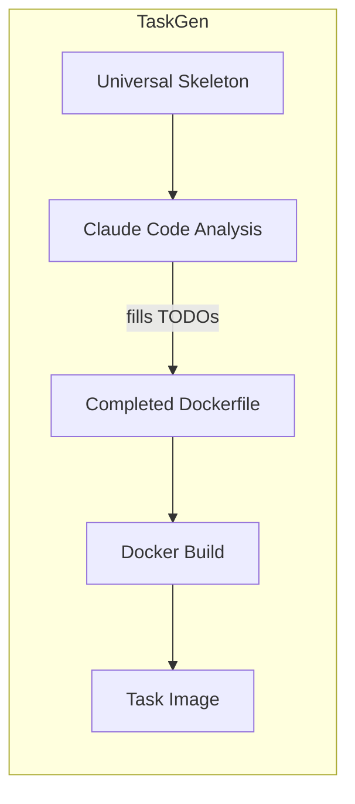
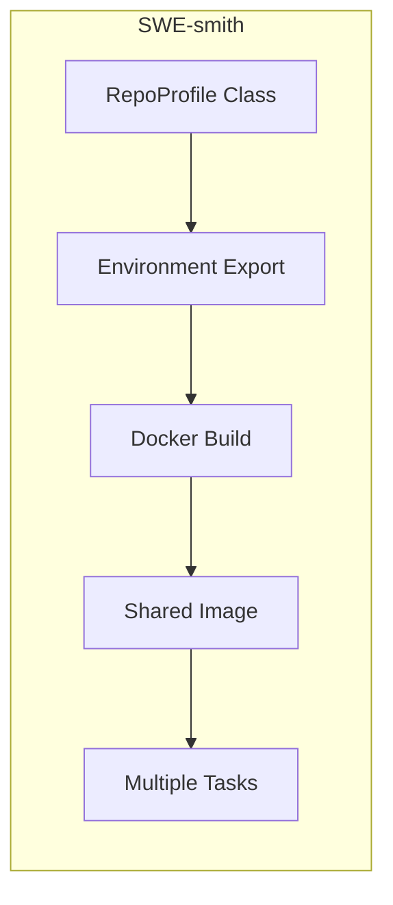
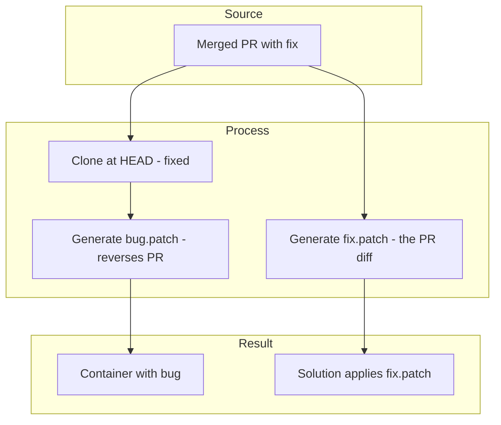
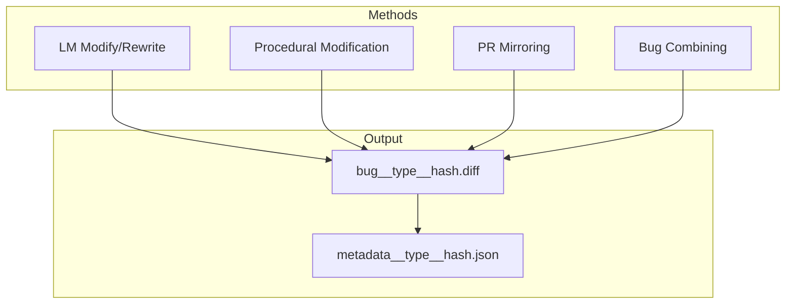
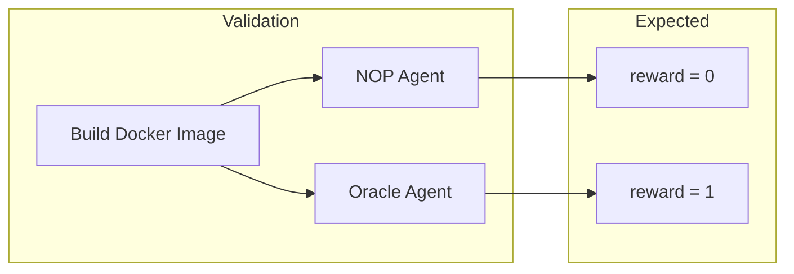
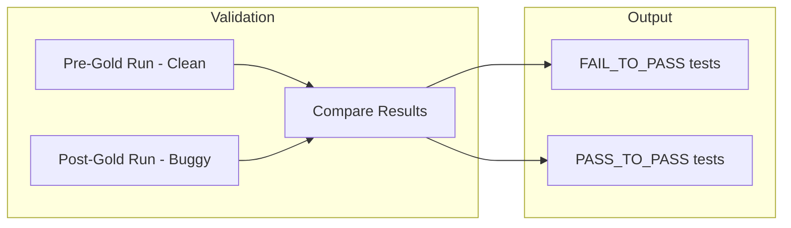
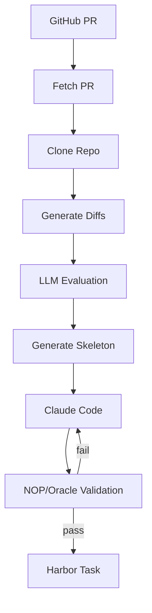
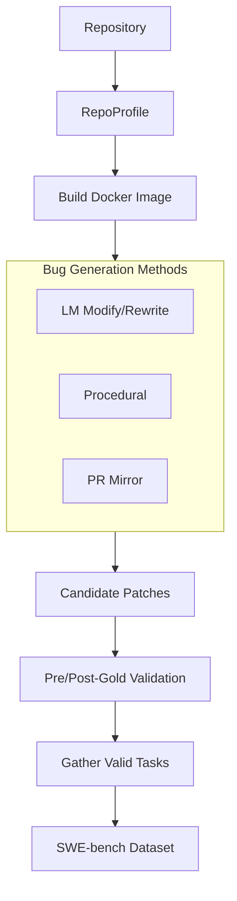

# TaskGen vs SWE-smith: Architecture Comparison

This document compares the architectures of **TaskGen** and **SWE-smith**, two systems for generating software engineering evaluation tasks.

## Overview

| Aspect | TaskGen | SWE-smith |
|--------|---------|-----------|
| **Purpose** | Convert merged PRs into Harbor tasks | Synthesize bugs for SWE-bench evaluation |
| **Task Source** | Real bug fixes (reversed) | LLM-generated, procedural, PR mirroring |
| **Target Format** | Harbor task structure | SWE-bench task format |
| **Language Support** | Any (Claude Code detects) | Profile-based (Python primary, others via profiles) |
| **Automation** | Fully automated with Claude Code | Semi-automated with manual profile creation |

---

## Docker Image Creation

The approaches to Docker image creation represent one of the most significant architectural differences between the two systems.

### TaskGen Approach: Per-Task Generation

TaskGen generates a **new Dockerfile for each task** using a universal skeleton that Claude Code fills in:



**Key characteristics:**
- Base image: Always `ubuntu:24.04`
- Configuration: TODO-based template filled by Claude Code
- Per-task: Each task gets its own Dockerfile
- Caching: Task references cache patterns for same-repo PRs

**Dockerfile skeleton example:**
```dockerfile
FROM ubuntu:24.04
# Base packages always included
RUN apt-get update && apt-get install -y git curl patch build-essential

# TODO: Install language runtime (Claude Code fills this)
# TODO: Install dependencies
# TODO: Build if needed

# Clone at HEAD, apply bug.patch
RUN git clone <repo> src && cd src && git checkout <sha>
COPY bug.patch /tmp/bug.patch
RUN patch -p1 < /tmp/bug.patch

# TODO: Rebuild after patching
```

### SWE-smith Approach: Pre-Built from RepoProfiles

SWE-smith uses **pre-defined RepoProfile classes** that specify exactly how to build images for each repository+commit combination:



**Key characteristics:**
- Base image: Profile-defined (often language-specific)
- Configuration: Python class with `install_cmds`, `get_test_cmd`
- Per-repo+commit: One image serves many tasks from same repo
- Pre-built: Images built before task generation

**RepoProfile example:**
```python
@dataclass
class AstroidB114f6b5(PythonProfile):
    owner: str = "pylint-dev"
    repo: str = "astroid"
    commit: str = "b114f6b58e749b8ab47f80490dce73ea80d8015f"
    # Inherits build logic from PythonProfile
```

### Comparison Table

| Aspect | TaskGen | SWE-smith |
|--------|---------|-----------|
| **Image creation** | Per-task, on-demand | Pre-built, shared |
| **Base image** | Universal (ubuntu:24.04) | Profile-defined |
| **Configuration** | Claude Code fills TODOs | Python class methods |
| **Language detection** | Automatic (Claude Code) | Manual (profile selection) |
| **Reusability** | Task references cache patterns | One image per repo+commit |
| **Build time** | Each task builds image | Amortized across tasks |
| **Flexibility** | Any repository | Requires profile creation |

---

## Task Instance Creation

### TaskGen: Reversed PR Strategy

TaskGen creates tasks from **real bug fixes** by reversing the fix:



**Key characteristics:**
- Source: Merged GitHub PRs (real bug fixes)
- Bug creation: Reverse the fix (bug.patch reverts PR)
- Test handling: Tests extracted separately, copied at runtime
- Diversity: Limited to bugs that have been fixed via PRs

### SWE-smith: Multi-Method Bug Synthesis

SWE-smith offers **multiple methods** for creating bugs:



**Bug generation methods:**

| Method | Description |
|--------|-------------|
| **LM Modify** | LLM modifies existing code to introduce bugs |
| **LM Rewrite** | LLM rewrites functions from scratch (introducing bugs) |
| **Procedural** | AST-based transformations (remove if blocks, shuffle, etc.) |
| **PR Mirroring** | Similar to TaskGen's approach |
| **Combining** | Merge multiple single-file bugs into multi-file tasks |

### Comparison Table

| Aspect | TaskGen | SWE-smith |
|--------|---------|-----------|
| **Bug source** | Real bug fixes (reversed) | Synthetic + PR mirroring |
| **Bug authenticity** | High (real bugs) | Variable (synthetic may be artificial) |
| **Diversity** | Limited to existing PRs | High (multiple methods) |
| **Scale** | Bounded by PR history | Theoretically unlimited |
| **Complexity** | Multi-file by default | Single-file, combinable |
| **Test coverage** | PR's actual tests | Existing test suite |

---

## Validation Architecture

Both systems validate that generated tasks are solvable and meaningful, but use different approaches.

### TaskGen: NOP/Oracle Validation

TaskGen validates using Harbor's built-in agents:



**Validation criteria:**
- **NOP agent**: Does nothing → tests must fail (reward=0)
- **Oracle agent**: Applies fix.patch → tests must pass (reward=1)
- **Iteration**: Claude Code fixes issues until both pass

### SWE-smith: Pre-Gold/Post-Gold Validation

SWE-smith validates by comparing test results before and after applying the bug:



**Validation criteria:**
- **Pre-Gold**: Run tests on clean repo → establish baseline
- **Post-Gold**: Apply bug patch, run tests → identify failures
- **FAIL_TO_PASS**: Tests that passed in pre-gold but fail in post-gold
- **Valid task**: Must have at least 1 FAIL_TO_PASS and 1 PASS_TO_PASS

### Comparison Table

| Aspect | TaskGen | SWE-smith |
|--------|---------|-----------|
| **Method** | NOP/Oracle agents | Pre-gold/Post-gold comparison |
| **Success criteria** | NOP=0, Oracle=1 | FAIL_TO_PASS identified |
| **Iteration** | Claude Code auto-fixes | Manual/batch reprocessing |
| **Docker builds** | Per validation attempt | Pre-built image reused |
| **Parallelization** | Sequential in Claude Code | Highly parallel batch |

---

## Language Support

### TaskGen: Universal with Auto-Detection

TaskGen supports **any language** because Claude Code analyzes the repository:

- Reads package.json, pyproject.toml, go.mod, Cargo.toml, etc.
- Checks CI configs for setup hints
- Installs appropriate runtime and dependencies
- No manual configuration needed per language

**Supported out-of-box**: Python, JavaScript, TypeScript, Go, Rust, Ruby, Java, and any language Claude Code can identify.

### SWE-smith: Profile-Based

SWE-smith requires **profile classes** for each language:

- `PythonProfile` - Full support with try_install automation
- `JavaProfile`, `RustProfile`, etc. - Require manual Dockerfile creation
- No automated installer for non-Python languages

**Full support**: Python
**Partial support**: JavaScript, Rust, Java, Go (requires profile creation)

---

## When to Use Which

### Use TaskGen When:

- You want **real bugs** from actual bug fixes
- You need **language-agnostic** support without configuration
- You want **fully automated** task generation
- Quality matters more than quantity
- Working with repositories that have good PR history

### Use SWE-smith When:

- You need **large-scale** task generation
- You want **diverse bug types** (procedural, LLM-generated)
- Working primarily with **Python** repositories
- You have established **RepoProfiles** for target repos
- Training data quantity is the priority

---

## Architecture Diagram Comparison

### TaskGen Pipeline



### SWE-smith Pipeline



---

## Summary

| Dimension | TaskGen | SWE-smith |
|-----------|---------|-----------|
| **Philosophy** | Quality from real bugs | Quantity from synthesis |
| **Docker images** | Per-task, Claude Code generated | Pre-built from profiles |
| **Bug source** | Reversed PRs | Multiple synthesis methods |
| **Language support** | Universal (auto-detect) | Profile-based |
| **Validation** | NOP/Oracle with iteration | Pre/Post-gold batch |
| **Automation** | Fully automated | Semi-automated |
| **Scalability** | Bounded by PR history | Theoretically unlimited |
| **Output format** | Harbor tasks | SWE-bench format |

