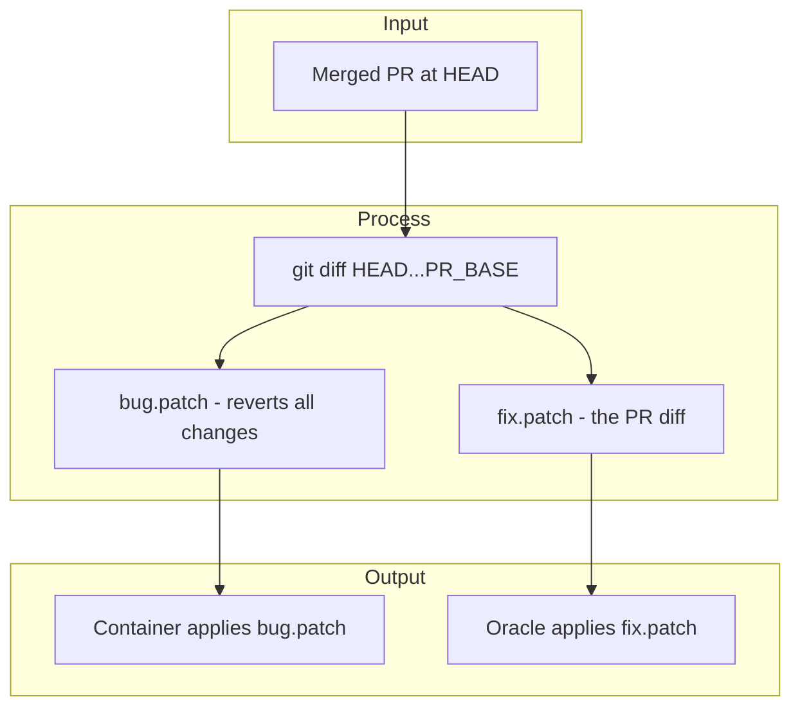
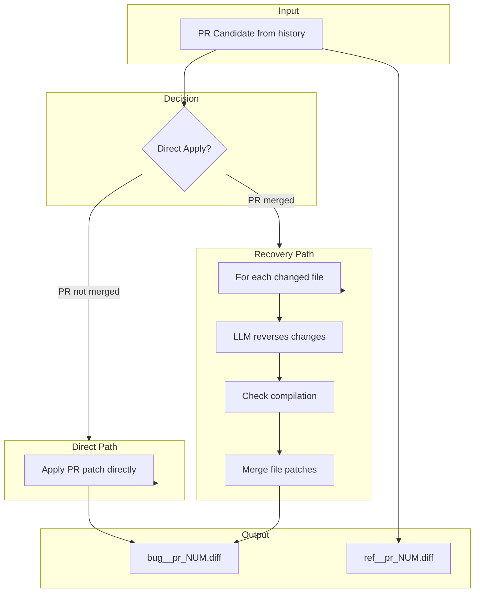
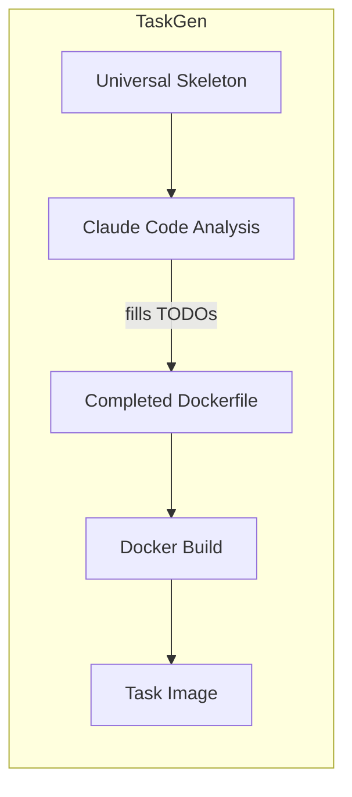
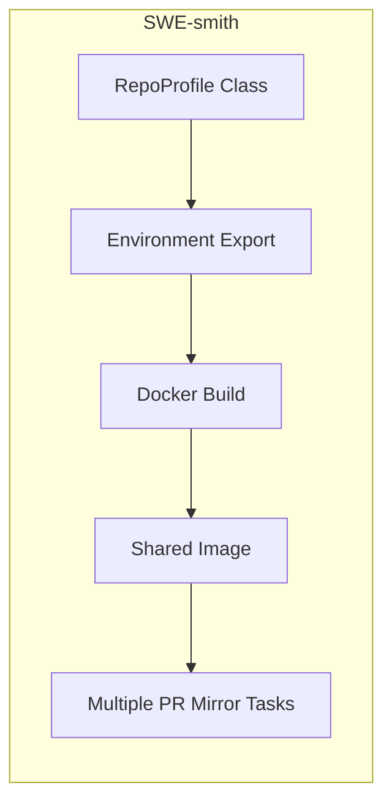
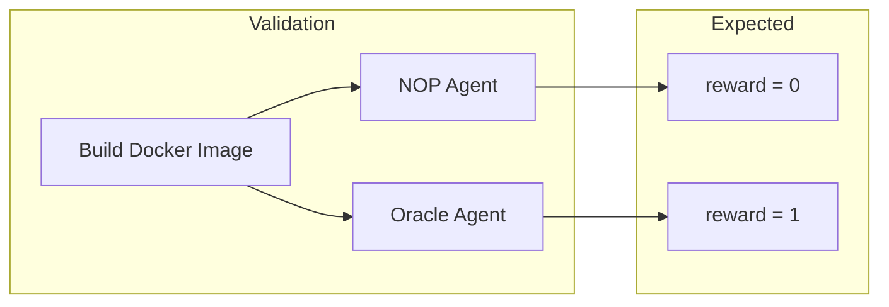
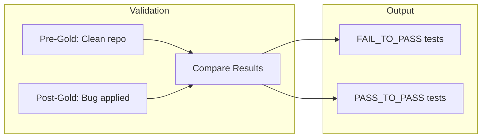
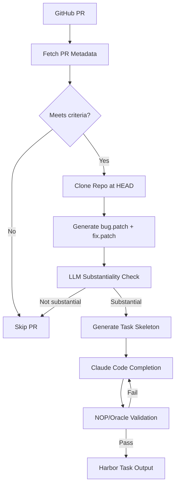
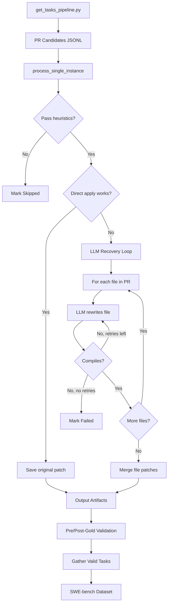

# TaskGen vs SWE-smith PR Mirroring: Architecture Comparison

This document compares the architectures of **TaskGen** and **SWE-smith PR Mirroring**, two systems for generating software engineering evaluation tasks from real pull requests.

> **Note**: SWE-smith supports multiple bug generation methods (LM Modify/Rewrite, Procedural Modification, PR Mirroring, Bug Combining). This document focuses specifically on the **PR Mirroring** technique, which is most similar to TaskGen's approach.

## Overview

| Aspect | TaskGen | SWE-smith PR Mirroring |
|--------|---------|------------------------|
| **Purpose** | Convert merged PRs into Harbor tasks | Mirror PR bugs into current codebase for SWE-bench |
| **Task Source** | Merged PRs (reversed at HEAD) | Merged PRs (ported to current commit) |
| **Target Format** | Harbor task structure | SWE-bench task format |
| **Reversal Method** | Git diff (entire PR at once) | LLM file-by-file rewrite |
| **Language Support** | Any (Claude Code detects) | Profile-based (Python primary) |
| **Automation** | Fully automated with Claude Code | Requires pre-built RepoProfile |

---

## Core Concept: Bug Recreation from PRs

Both systems share the same fundamental insight: **real bug fixes from PRs can be reversed to recreate the buggy state**. However, they differ significantly in how they accomplish this reversal.

### The Challenge

When a PR that fixes a bug is merged:
- The fix is now part of the codebase
- Simply checking out the parent commit often doesn't work (dependencies change, APIs evolve)
- Tests may have been updated alongside the fix

Both systems solve this by working with the **current** codebase and applying patches to recreate the buggy state.

---

## Reversal Strategy

The approaches to reversing a PR represent the most significant architectural difference between the two systems.

### TaskGen: Git-Based Patch Reversal

TaskGen generates a **single `bug.patch`** that reverses the entire PR using git diff:



**Key characteristics:**
- Reversal is **deterministic** - git diff produces exact inverse
- Entire PR reversed **atomically** in one patch
- Always applies cleanly (HEAD contains exactly the changes being reversed)
- No LLM involvement in patch generation

**Patch generation:**
```python
# TaskGen generates bug.patch as inverse of PR
bug_patch = git_diff(head_sha, pr_base_sha, exclude=test_files)
fix_patch = git_diff(pr_base_sha, head_sha, exclude=test_files)
```

### SWE-smith PR Mirroring: LLM-Based File Rewriting

SWE-smith uses an **LLM to rewrite each file**, porting the bug to the current codebase:



**Key characteristics:**
- **Two paths**: Direct apply (if PR not merged) or Recovery (LLM rewrite)
- File-by-file processing allows **partial success**
- Can **port historical bugs** to current codebase version
- LLM handles code drift between PR version and current version

**Recovery prompt (simplified):**
```
You are given the source code of a file and a corresponding diff patch.
Your task is to rewrite the entire source code while reversing the changes
indicated by the diff patch.

If a line was added in the diff, remove it.
If a line was removed, add it back.
If a line was modified, restore it to its previous state.

DO NOT MAKE ANY OTHER CHANGES TO THE SOURCE CODE.
```

### Comparison: Reversal Approaches

| Aspect | TaskGen | SWE-smith PR Mirroring |
|--------|---------|------------------------|
| **Method** | Git diff (deterministic) | LLM rewrite (generative) |
| **Granularity** | Entire PR at once | File by file |
| **Code drift handling** | N/A (always applies cleanly) | LLM adapts to drift |
| **Compilation check** | Via test execution | Per-file compilation gate |
| **Patch retry mechanism** | None (guaranteed to apply) | Up to 5 LLM retries per file |
| **Cost** | No LLM cost for patch | LLM cost per file rewritten |
| **Accuracy** | Exact (git-based) | Approximate (LLM-based) |

> **Note on TaskGen patch application**: TaskGen clones the repo at HEAD (where the PR is already merged) and applies a reverse diff (HEAD→BASE). Since HEAD contains exactly the changes being reversed, the patch is guaranteed to apply cleanly by construction. Claude Code iterates on *Dockerfile/test.sh configuration* (dependencies, build steps, test commands) but never modifies the patch itself.

---

## Docker Image Architecture

### TaskGen: Per-Task Dockerfile Generation

TaskGen generates a **new Dockerfile for each task** using a universal skeleton that Claude Code completes:



**Key characteristics:**
- Base image: Always `ubuntu:24.04`
- Configuration: TODO-based template filled by Claude Code
- Per-task: Each task gets its own Dockerfile
- Caching: Task references cache patterns for same-repo PRs

**Dockerfile skeleton example:**
```dockerfile
FROM ubuntu:24.04
RUN apt-get update && apt-get install -y git curl patch build-essential

# TODO: Install language runtime (Claude Code fills this)
# TODO: Install dependencies
# TODO: Build if needed

RUN git clone <repo> src && cd src && git checkout <sha>
COPY bug.patch /tmp/bug.patch
RUN patch -p1 < /tmp/bug.patch

# TODO: Rebuild after patching
```

### SWE-smith: Pre-Built RepoProfile Images

SWE-smith uses **pre-defined RepoProfile classes** that specify exactly how to build images for each repository+commit:



**Key characteristics:**
- Base image: Profile-defined (often language-specific)
- Configuration: Python class with `install_cmds`, `get_test_cmd`, `compile_cmd`
- Per-repo+commit: One image serves many tasks from same repository
- Pre-built: Images built before task generation begins

**RepoProfile example:**
```python
@dataclass
class AstroidB114f6b5(PythonProfile):
    owner: str = "pylint-dev"
    repo: str = "astroid"
    commit: str = "b114f6b58e749b8ab47f80490dce73ea80d8015f"
    # Inherits: install_cmds, get_test_cmd, compile_cmd, log_parser
```

### Comparison: Image Strategies

| Aspect | TaskGen | SWE-smith PR Mirroring |
|--------|---------|------------------------|
| **Image creation** | Per-task, on-demand | Pre-built, shared across tasks |
| **Base image** | Universal (ubuntu:24.04) | Profile-defined |
| **Configuration** | Claude Code fills TODOs | Python class methods |
| **Language detection** | Automatic (Claude Code) | Manual (profile selection) |
| **Build time** | Each task builds image | Amortized across all tasks |
| **Flexibility** | Any repository | Requires profile creation first |
| **Image reuse** | Task references cache patterns | Direct reuse for same repo+commit |

---

## Test Handling

### TaskGen: Extracted Test Files

TaskGen **extracts test files** from the PR and stores them separately:

```
tasks/<task_id>/
├── environment/
│   ├── Dockerfile
│   └── bug.patch      # Excludes test files
├── solution/
│   ├── fix.patch      # Excludes test files
│   └── solve.sh
└── tests/
    ├── test.sh        # Runs specific test files
    └── test_*.py      # Extracted from HEAD
```

**Key characteristics:**
- Tests excluded from `bug.patch` and `fix.patch`
- Test files extracted from HEAD, stored in `tests/` directory
- `test.sh` copies tests into container at verification time
- Agents cannot see or modify test files

### SWE-smith: Git History Test Hiding

SWE-smith uses **git branches** to hide and reveal test files:

```
Branch: <instance_id>
├── HEAD~1 (Bug Patch commit)
│   └── Tests present, bug active
└── HEAD (Remove F2P Tests commit)
    └── Tests removed, bug active
```

**Key characteristics:**
- Each task gets a dedicated git branch
- Bug patch committed with tests present (HEAD~1)
- Follow-up commit removes F2P test files (HEAD)
- During evaluation: `git checkout HEAD~1` restores tests
- Test patch not stored in dataset - baked into git history

### Comparison: Test Strategies

| Aspect | TaskGen | SWE-smith PR Mirroring |
|--------|---------|------------------------|
| **Test storage** | Separate `tests/` directory | Git branch history |
| **Test hiding** | Not in container until test.sh | Removed at HEAD, restored via checkout |
| **Test isolation** | Physical file separation | Git commit separation |
| **Test modification** | Impossible (not in container) | Reverted if agent modifies |
| **Test discovery** | Files copied at runtime | `git checkout HEAD~1` |

---

## Validation Architecture

### TaskGen: NOP/Oracle Validation

TaskGen validates using Harbor's built-in agents:



**Validation criteria:**
- **NOP agent**: Does nothing → tests must fail (reward=0)
- **Oracle agent**: Applies fix.patch → tests must pass (reward=1)
- **Iteration**: Claude Code fixes Dockerfile/test.sh issues until both pass

### SWE-smith: Pre-Gold/Post-Gold Validation

SWE-smith validates by comparing test results before and after applying the bug:



**Validation criteria:**
- **Pre-Gold**: Run tests on clean repo → establish passing baseline
- **Post-Gold**: Apply bug patch, run tests → identify failures
- **FAIL_TO_PASS**: Tests that passed pre-gold but fail post-gold
- **Valid task**: Must have ≥1 FAIL_TO_PASS and ≥1 PASS_TO_PASS

### Comparison: Validation Approaches

| Aspect | TaskGen | SWE-smith PR Mirroring |
|--------|---------|------------------------|
| **Method** | NOP/Oracle agent execution | Pre-gold/Post-gold comparison |
| **Success criteria** | NOP=0, Oracle=1 | ≥1 FAIL_TO_PASS identified |
| **Iteration** | Claude Code auto-fixes | Manual reprocessing |
| **Docker builds** | Per validation attempt | Pre-built image reused |
| **Parallelization** | Sequential in Claude Code | Highly parallel batch |
| **Output** | Pass/fail per agent | Explicit test categorization |

---

## PR Candidate Filtering

Both systems filter PRs before processing, but with different criteria.

### TaskGen Filtering

```python
# TaskGen PR requirements
- Must be merged to primary branch
- Must include test file changes
- Must modify 3-10 source files (configurable)
- Must have linked issue (configurable)
- Must pass LLM substantiality check
```

### SWE-smith PR Mirroring Filtering

```python
# SWE-smith PR Mirroring requirements (from should_attempt_recovery)
- Must have non-empty 'test_patch' field (for FAIL_TO_PASS)
- Must modify ≤8 source files
- Must change ≤500 lines total
- No changed file >10,000 lines
- No binary files
- Must have ≥1 file with supported extension
```

### Comparison: Filtering Criteria

| Criteria | TaskGen | SWE-smith PR Mirroring |
|----------|---------|------------------------|
| **Linked issue** | Required (configurable) | Required for initial collection |
| **Test changes** | Required | Required (test_patch field) |
| **Min source files** | 3 (configurable) | 1 |
| **Max source files** | 10 (configurable) | 8 |
| **Max lines changed** | No limit | 500 |
| **Binary files** | Allowed | Excluded |
| **Substantiality check** | LLM evaluation | Heuristic-based |

---

## Language Support

### TaskGen: Universal with Auto-Detection

TaskGen supports **any language** through Claude Code analysis:

- Reads package.json, pyproject.toml, go.mod, Cargo.toml, etc.
- Checks CI configs (`.github/workflows/`) for setup hints
- Installs appropriate runtime and dependencies
- No manual configuration needed per language

**Supported out-of-box**: Python, JavaScript, TypeScript, Go, Rust, Ruby, Java, and any language Claude Code can identify.

### SWE-smith: Profile-Based

SWE-smith requires **RepoProfile classes** for each language:

- `PythonProfile` - Full support with `try_install_py` automation
- `JavaProfile`, `RustProfile`, etc. - Require manual Dockerfile creation
- No automated installer for non-Python languages
- Profiles define: `install_cmds`, `get_test_cmd`, `compile_cmd`, `log_parser`

**Full support**: Python
**Partial support**: JavaScript, Rust, Java, Go (requires manual profile creation)

---

## Output Formats

### TaskGen: Harbor Task Structure

```
tasks/<owner>__<repo>-<pr_number>/
├── environment/
│   ├── Dockerfile      # Complete, buildable
│   └── bug.patch       # Reverts PR (excludes tests)
├── instruction.md      # Bug description from issue/PR
├── task.toml           # Metadata (difficulty, tags)
├── solution/
│   ├── fix.patch       # The PR diff (excludes tests)
│   └── solve.sh        # Applies fix.patch
└── tests/
    ├── test.sh         # Runs specific test files
    └── <test_files>    # Extracted from HEAD
```

### SWE-smith: SWE-bench Task Format

```json
{
  "instance_id": "pylint-dev__astroid.b114f6b5.pr_1234",
  "repo": "swesmith/pylint-dev__astroid.b114f6b5",
  "patch": "<bug-introducing diff>",
  "FAIL_TO_PASS": ["tests/test_inference.py::test_case"],
  "PASS_TO_PASS": ["tests/test_inference.py::test_other"],
  "image_name": "swesmith.x86_64.pylint-dev__astroid.b114f6b5"
}
```

**Key difference**: In SWE-smith, `patch` is the **bug-introducing** diff. In Harbor, `bug.patch` and `fix.patch` are separate files with clear semantics.

---

## Pipeline Diagrams

### TaskGen Pipeline



### SWE-smith PR Mirroring Pipeline



---

## When to Use Which

### Use TaskGen When:

- You want **exact reproductions** of real bug fixes
- You need **language-agnostic** support without manual configuration
- You want **fully automated** end-to-end task generation
- Working with **recently merged PRs** (at HEAD)
- You need Harbor-compatible task output

### Use SWE-smith PR Mirroring When:

- You need to **port historical bugs** from older PRs to current codebase
- The codebase has evolved significantly since the PR was merged
- You already have **RepoProfiles** for target repositories
- You want to process PRs **in batch** with high parallelization
- You need SWE-bench-compatible task output
- Working primarily with **Python** repositories

---

## Summary

| Dimension | TaskGen | SWE-smith PR Mirroring |
|-----------|---------|------------------------|
| **Reversal method** | Git diff (deterministic) | LLM file-by-file (generative) |
| **Code drift handling** | N/A (always applies cleanly) | LLM adapts to drift |
| **Docker images** | Per-task, Claude Code generated | Pre-built, shared from profiles |
| **Test handling** | Extracted to separate directory | Hidden in git history |
| **Validation** | NOP/Oracle agents | Pre/Post-gold comparison |
| **Language support** | Universal (auto-detect) | Profile-based (Python primary) |
| **Automation level** | Fully automated | Semi-automated (needs profiles) |
| **Output format** | Harbor tasks | SWE-bench format |
| **LLM cost for patches** | None | Per-file rewrite cost |
| **Parallelization** | Sequential (Claude Code) | Highly parallel batch |
